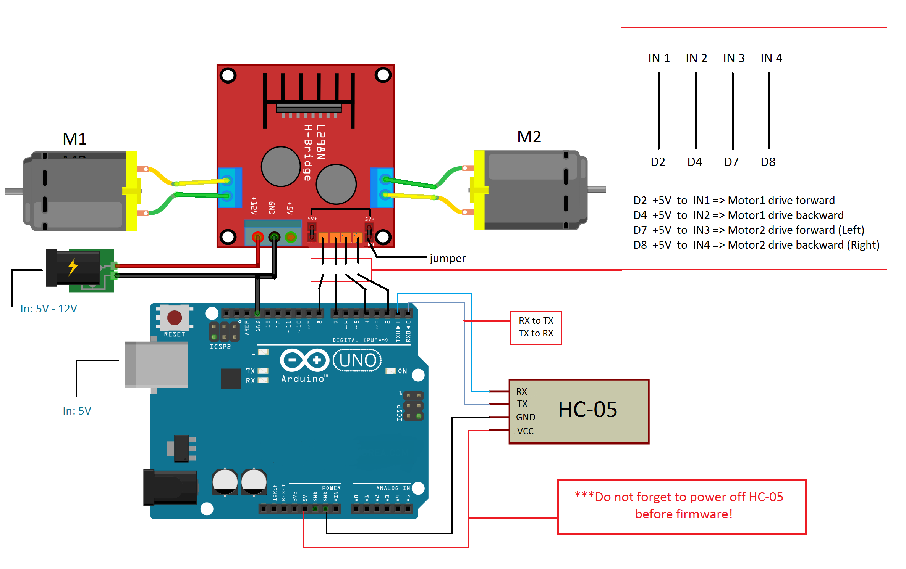

# Bluetooth-car
Chinise car with two motors upgrades to bluetooth car

<b>What is used:</b>
1. Arduino UNO (Copy).        
    - I have been trying with Nano, but it does not worked for me. Maybei am try later again ;)
2. Bluetooth module HC-05.    
    - For easy way do not use HC-06 because of problem with Master-Slave.
3. L298N driver for two motors with switch button.
4. Chinise remote car. 
    - I have cutted off all except for 2 motors.
5. Bluetooth RC Controller app (Android)

<b>Do not forget: ------!!!!!!!!!------</b>
1. Bluetooth Rx to Uno Tx
2. Bluetooth Tx to Uno Rx
3. L298N power GND to Uno GND.
4. Create the bluetooth pair: Smartphone + HC-05 before open the app (Android 10, maybe it is needed for earlier OS).
5. App always send 'S' (Stop)
6. Do not use any libraries. As i understand it does not work correct.

<b>How does it works:</b>
1. Uno creates Serial on 9600 with HC-05.
      - HC-05 works on 9600, HC-06 on 38400.

2. Uno sets LOW signal to motors.
      - digitalWrite(motorForward, LOW);
      - digitalWrite(motorBack, LOW);
      
3. HC-05 connects to smartPhone and getting bytes like F - forward, B - backword... e.t.c from the app every 50 ms.
     - S S S S S S S F F F F F S S B B B... e.t.c

4. Uno goes into Loop and Starts to read Serial port. 
      - if command from serial matches to one of the case, Uno set HIGH signal to one of the motors.

5. If command does not match it is ignored.

